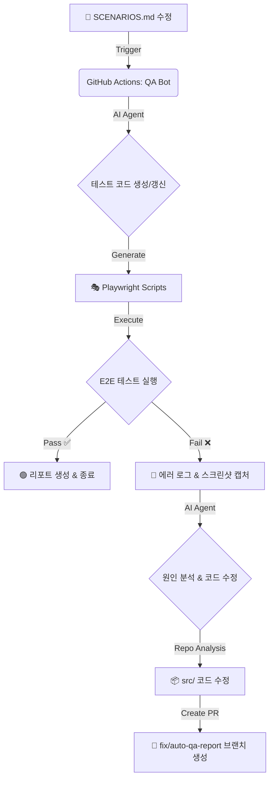

# AI-Native QA & Auto-Fix 파이프라인 설계서

**작성일:** 2026-02-05
**작성자:** Antigravity Agent (AGI)
**목표:** `docs/qa/SCENARIOS.md`를 기반으로 테스트 자동화, 결과 보고, 자동 수정까지 이어지는 완전 자동화된 루프 구축

---

## 1. 개요 및 추천 전략 (Recommendation)

사용자님은 "QA 시스템"을 언급하셨으나, 최고 수준의 AGI 관점에서 가장 효율적이고 확장성 높은 방법은 **"외부 상용 툴"에 의존하는 것이 아니라, 프로젝트 내부에 [LLM + Playwright + GitHub Actions] 파이프라인을 내재화하는 것**입니다.

### 왜 이 방식이 최고인가?
1.  **Living Code**: 테스트 시나리오(`SCENARIOS.md`)가 변경되면 AI가 즉시 테스트 코드(`Spec`)를 갱신합니다. 문서와 코드가 100% 동기화됩니다.
2.  **Self-Healing**: 테스트 실패 시, AI가 단순 로그만 보는 것이 아니라 소스 코드(`src/`)를 분석하여 수정 PR을 자동으로 생성합니다.
3.  **No Vendor Lock-in**: 비싼 외부 QA 서비스 비용 없이, GitHub Actions와 LLM API 비용만으로 운용 가능합니다.

---

## 2. 아키텍처 다이어그램

---

## 3. 상세 프로세스 (3-Step Loop)

### Step 1: Scenario to Code (변환)
*   **Input**: `docs/qa/SCENARIOS.md`, `src/app/**` (라우트 구조)
*   **AI Action**: 시나리오의 각 항목(예: `AUTH-01`)을 **Playwright TypeScript (`tests/auth.spec.ts`)** 코드로 변환합니다.
*   **Key Tech**: AI가 HTML 구조를 예측하거나, 실행 중 `data-testid`가 없으면 자동으로 식별자를 유추하는 로직 포함.

### Step 2: Execution (검증)
*   **Engine**: **Playwright** (Headless Browser)
*   **Environment**: GitHub Actions Runner (Ubuntu Latest)
*   **Output**:
    *   JUnit/HTML Report
    *   Trace Viewer (실패 지점 비디오 녹화)

### Step 3: Report & Repair (보고 및 복구)
*   **Reporting**: GitHub Issue Comment 또는 PR Comment로 요약 리포트 게시.
*   **Auto-Fix**:
    1.  실패한 테스트의 Trace와 에러 로그를 AI에게 전달.
    2.  AI가 `src/` 코드를 읽고 문제 원인(예: UI 변경으로 인한 Selector 불일치, 실제 로직 버그) 파악.
    3.  수정 코드를 담은 새로운 브랜치(`fix/qa-{date}`)를 push하고 **Pull Request** 생성.

---

## 4. 구현 로드맵 (Action Plan)

이 파이프라인을 구축하기 위해 다음 단계가 필요합니다.

1.  **인프라 설정 (Infrastructure)**
    *   Playwright 설치 및 설정 (`playwright.config.ts`)
    *   GitHub Actions Workflow 작성 (`.github/workflows/ai-qa.yml`)

2.  **AI 에이전트 스크립트 구현 (Scripts)**
    *   `scripts/generate-tests.ts`: 마크다운 시나리오 -> 테스트 코드 변환기
    *   `scripts/auto-fix.ts`: 에러 로그 -> 소스 수정기

3.  **실행 및 검증**
    *   현재 시나리오(`SCENARIOS.md`)를 기반으로 첫 번째 테스트 코드 생성
    *   CI 파이프라인 가동 및 Auto-Fix 동작 확인

---

## 5. 결론

이 설계는 단순한 "테스트 실행"을 넘어, **개발 -> 테스트 -> 수정**의 사이클 자체를 자동화하는 **Autonomous Dev Loop**의 시초가 될 것입니다.

승인해주신다면, **Step 4 (구현 로드맵)** 에 따라 즉시 Playwright 설치와 워크플로우 생성을 시작하겠습니다.
